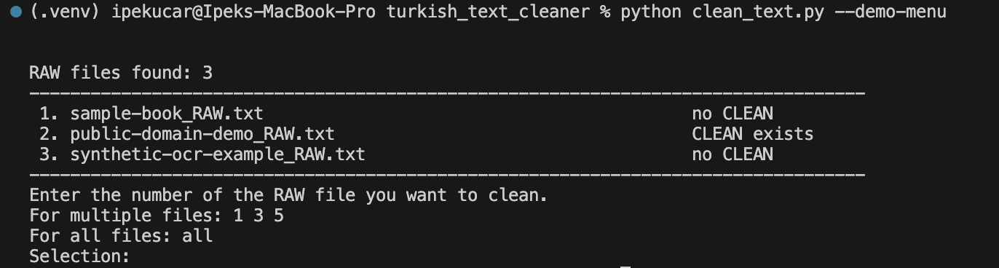

# Turkish Text Cleaner

A Turkish first, language adaptable pipeline for turning noisy book PDF extractions into cleaner plain text.

This project is designed for the messy middle step between **PDF extraction** and **usable NLP-ready text**. It does not distribute books or datasets. Instead, it helps users clean their own legally usable PDF derived text by removing page artifacts, headers, footers, chapter headings, footnotes, OCR noise, broken words, and selected Turkish specific extraction errors.

The current implementation is optimized for Turkish literary texts, but the overall architecture can be adapted to other languages through future language profiles.

> This repository does not include book PDFs, extracted RAW text, or CLEAN text outputs. Users must provide their own legally usable input files.

## Potential Use Cases

This project is designed as a preprocessing layer for Turkish NLP, Document AI, and digital humanities workflows. Its goal is not to publish book datasets, but to help users transform legally available PDF texts into cleaner plain text for downstream research or machine learning pipelines.

Possible use cases include:

- Preparing cleaner corpora for Turkish language modeling research
- Cleaning text before continued pretraining, fine-tuning, or evaluation workflows
- Building higher-quality text inputs for RAG systems
- Creating post OCR correction benchmarks
- Supporting digital humanities research on Turkish literary texts
- Preparing structured corpora for stylometry, authorship analysis, topic modeling, and linguistic analysis
- Comparing rule-based, morphology-based, and AI assisted text cleaning methods

Clean text is a critical prerequisite for language model training and evaluation. Noisy PDF extractions can introduce page numbers, headers, broken words, OCR artifacts, and non-main-text sections into a corpus. If left unfiltered, these artifacts can degrade downstream model quality. This project focuses on the preprocessing step: converting noisy PDF derived text into cleaner, main-text-oriented plain text.

## Why This Exists

Book PDFs are rarely ready for NLP or LLM workflows after a plain extraction step. Extracted text often contains:

- Page numbers
- Running headers and footers
- Chapter and section titles
- Footnotes and bibliographic blocks
- Line-break hyphenation
- OCR noise
- Intraword spacing errors, such as `toplumla rının`
- Glued words, such as `Bukitap` or `ayönce`
- Front/back matter that is not part of the author's main text

This project tries to clean those artifacts with structural and statistical signals rather than brittle one-off regex rules.

## Pipeline Overview

The project follows a staged pipeline. The current design intentionally keeps one human-in-the-loop step because fully reliable front/back matter detection is still an open problem.

```text
PDF -> RAW text -> manual front/back matter trim -> CLEAN text
```

### 1. PDF Extraction

Input PDF files are placed under `book-input/`.

The extraction step converts each PDF into a RAW text file:

```bash
python extract_text.py
```

Output:

```text
book-output-raw/{book_name}_RAW.txt
```

The extractor tries multiple backends when available:

- `pdftotext` / Poppler
- PyMuPDF
- Tesseract OCR fallback for scanned PDFs

At this stage, the text is still noisy. It may contain publisher pages, prefaces, tables of contents, page numbers, running headers, footnotes, broken words, OCR artifacts, and other PDF extraction errors.

### 2. Manual Gate

After RAW text is generated, the user manually opens the RAW file and removes front/back matter that does not belong to the author's main text.

Examples of manually removed sections:

- Publisher and copyright pages
- Prefaces
- Forewords
- Tables of contents
- Bibliographies
- Appendices
- Afterwords
- Editorial notes
- Back cover or catalog like material

This step currently exists because automatically distinguishing the main text from front/back matter is difficult across different publishers, editions, layouts, and genres.

A future version of the project could replace or assist this manual gate with an AI-based front/back matter detector.

Possible future approaches include:

- A page-level classifier that labels pages as `front_matter`, `main_text`, or `back_matter`
- A sequence model that detects the first and last main-text pages
- Layout-aware document models that use page position, typography, headings, and paragraph structure
- Human-in-the-loop review where the model proposes boundaries and the user confirms them

### 3. Cleaning

After the RAW file has been manually trimmed, the cleaning step is applied:

```bash
python clean_text.py
```

or for all local RAW files:

```bash
python clean_text.py --all --force
```

Output:

```text
book-output-clean/{book_name}_CLEAN.txt
```

The cleaning stage focuses on removing structural noise and repairing common PDF/OCR artifacts while preserving the author's main text.

## What the Cleaner Handles

The current cleaner handles:

- Repeated running headers and footers
- Sequential page numbers
- Isolated page number artifacts
- Chapter and section headings
- Numbered chapter heading blocks
- Decorative separator lines
- Bottom of page footnotes and citation blocks
- Line break hyphenation
- Soft hyphen artifacts
- OCR noise characters
- Some OCR glyph substitutions
- Intraword spacing errors
- Some glued-word errors
- Apostrophe spacing issues
- Turkish suffix-based word repairs
- Turkish specific casing and character issues
- Readable paragraph wrapping for easier manual review


The cleaner is Turkish first, but not every step is Turkish specific. Page number detection, repeated header/footer removal, heading detection, and the manual gate workflow can be adapted to other languages. Turkish specific parts mainly involve suffix behavior, OCR confusions, casing, and word repair heuristics.

## How to Use With Your Own PDFs

This project expects users to provide their own PDF files locally.

The repository does not include PDFs or extracted book text. Your local files should stay outside git tracking.

### Step 1: Put PDFs into `book-input/`

Create or use the existing `book-input/` folder and place your PDF files there:

```text
book-input/
  my-book.pdf
  another-book.pdf
```

This folder is ignored by git.

### Step 2: Run PDF Extraction

Run:

```bash
python extract_text.py
```

The script will scan `book-input/` and show an interactive numbered menu:

```text
PDF files found: 2
------------------------------------------------------------------------------
 1. my-book.pdf                                           no RAW
 2. another-book.pdf                                      no RAW
------------------------------------------------------------------------------
Enter the number of the PDF you want to extract.
For multiple files: 1 3 5
For all files: all
Selection:
```

Enter the number of the PDF you want to extract. For example:

```text
Selection: 1
```

The RAW text output will be created under:

```text
book-output-raw/my-book_RAW.txt
```

### Step 3: Manually Trim RAW Text

Open the generated RAW file:

```text
book-output-raw/my-book_RAW.txt
```

Before running the cleaner, manually remove front/back matter that is not part of the author's main text. Save the edited RAW file.

This manual gate is intentional in the current version. Front/back matter detection varies heavily across publishers, editions, and layouts, so this step is left for the user for now.

### Step 4: Run Cleaning

Run:

```bash
python clean_text.py
```

The script will scan `book-output-raw/` and show an interactive numbered menu:

```text
RAW files found: 1
----------------------------------------------------------------------------------
 1. my-book_RAW.txt                                          no CLEAN
----------------------------------------------------------------------------------
Enter the number of the RAW file you want to clean.
For multiple files: 1 3 5
For all files: all
Selection:
```

Enter the number of the RAW file you want to clean. For example:

```text
Selection: 1
```

The cleaned output will be created under:

```text
book-output-clean/my-book_CLEAN.txt
```

### Step 5: Review CLEAN Output

Open the CLEAN file and review the result:

```text
book-output-clean/my-book_CLEAN.txt
```

The cleaner will remove or repair many common artifacts, but it is not guaranteed to produce perfect text. Some OCR or context-dependent errors may remain and should be reviewed manually.

## Demo Menu and Screenshots

For README screenshots, use the screenshot-safe demo menu:

```bash
python clean_text.py --demo-menu
```

This prints a fake RAW selection menu without touching local files:

```text
RAW files found: 3
----------------------------------------------------------------------------------
 1. sample-book_RAW.txt                                          no CLEAN
 2. public-domain-demo_RAW.txt                                   CLEAN exists
 3. synthetic-ocr-example_RAW.txt                                no CLEAN
----------------------------------------------------------------------------------
Enter the number of the RAW file you want to clean.
For multiple files: 1 3 5
For all files: all
Selection:
```

Recommended screenshot:



Suggested location:

```text
docs/assets/demo-menu.png
```

Caption suggestion:

```text
Demo RAW selection menu generated with `python clean_text.py --demo-menu`.
No copyrighted book files or extracted text are shown.
```

Avoid screenshots that show:

- Full book pages
- RAW extracted book text
- CLEAN book text
- Long copyrighted excerpts
- PDF viewer pages from copyrighted books

For public documentation, prefer screenshots generated with the synthetic demo mode or `examples/demo_raw.txt`.

## Installation

```bash
python3 -m venv .venv
source .venv/bin/activate
pip install -r requirements.txt
```

After activating the virtual environment, use `python` in the commands below. If you are not inside the virtual environment, use `python3` instead.

For PDF extraction on macOS, Poppler is recommended:

```bash
brew install poppler
```

For OCR fallback:

```bash
brew install tesseract
brew install tesseract-lang
```

## Quick Commands

Run the copyright-safe synthetic demo:

```bash
python clean_text.py examples/demo_raw.txt --force
```

List local pipeline status:

```bash
python run_pipeline.py --list
```

Process one PDF:

```bash
python run_pipeline.py --book "Book.pdf"
```

Clean existing RAW files only:

```bash
python run_pipeline.py --clean-only --force
```

## Data and Copyright

This repository contains only code, documentation, and a synthetic demo file.

Do not commit:

- Book PDFs
- Full RAW text extracted from books
- Full CLEAN text outputs
- Screenshots containing long copyrighted excerpts

Users are responsible for working only with texts they own, have permission to process, or can legally use.

## Language Scope

The pipeline has two layers:

- **Language-independent core**
  - PDF extraction
  - Page association
  - Repeated header/footer detection
  - Sequential page-number tracking
  - Isolated heading detection
  - Manual gate workflow

- **Turkish-specific heuristics**
  - Turkish suffix fragments
  - Turkish casing behavior
  - Turkish OCR confusions
  - Turkish intraword spacing repair
  - Turkish glued word examples

Future versions can add language profiles such as `profiles/tr.py`, `profiles/en.py`, or `profiles/fr.py`.

## Current Limitations

- Front/back matter detection is currently manual.
- Some OCR errors require a language model, dictionary, or morphological analyzer.
- Some remaining character-level errors require post-OCR correction rather than simple heuristics.
- No pipeline can guarantee perfect text for every PDF/OCR quality level.

See [docs/future-work.md](docs/future-work.md).

## Future Research Directions

Several parts of the pipeline are intentionally left open for future research and community contributions.

### AI-assisted Front/Back Matter Detection

The current pipeline uses a manual gate after RAW extraction. A future version could train or integrate an AI model that detects where the author's main text begins and ends.

This could turn the manual step into a semi-automatic review workflow:

```text
PDF -> RAW -> AI boundary detection -> user confirmation -> CLEAN
```

### Better Post-OCR Correction Without Hard-coded Regex

Some remaining errors are character-level OCR corruptions or context dependent word splits. These are difficult to solve safely with rigid regex rules.

Future work could explore:

- Turkish morphological analyzers
- Edit-distance candidate generation
- Character confusion models
- Language-model scoring
- Context-aware correction
- Human-in-the-loop repair suggestions
- Language profiles for adapting the pipeline to other languages

The long term goal is to move from manually curated heuristics toward safer, testable, morphology-aware, and model-assisted text cleaning.

## Contributing

Useful contribution areas:

- Turkish morphological analysis integration
- Post-OCR correction
- Front/back matter classification
- Better footnote/endnote detection
- Public-domain test samples
- Evaluation metrics
- Language profiles for non-Turkish texts

Start with [CONTRIBUTING.md](CONTRIBUTING.md).

Before publishing a fork or release, see [docs/release-checklist.md](docs/release-checklist.md).

## Project Area

This project sits at the intersection of:

- Turkish NLP
- Document AI
- Digital Humanities
- Information Extraction
- Post-OCR Text Correction
- Data Cleaning Pipeline Engineering

## License

This project is licensed under the MIT License. See [LICENSE](LICENSE).
